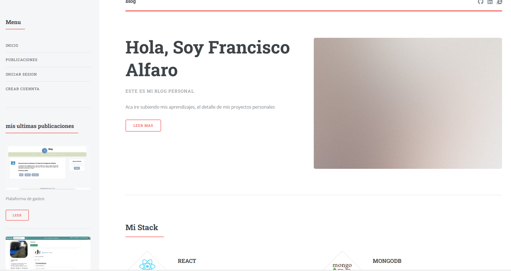
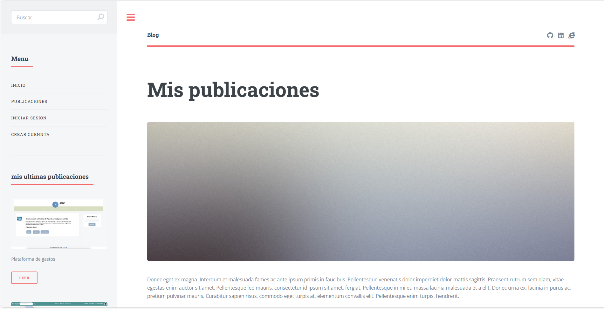
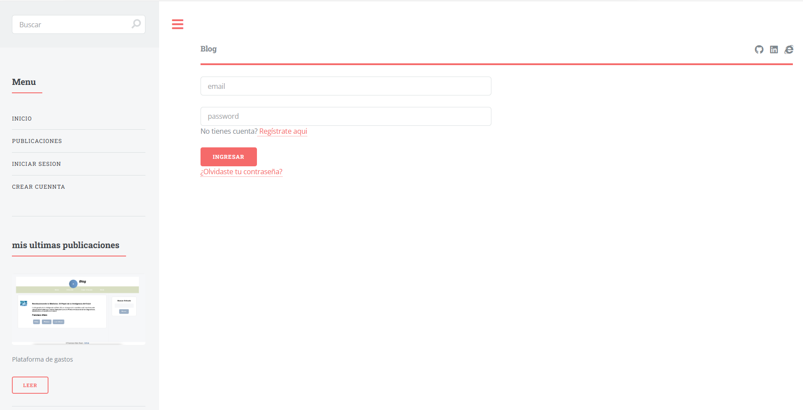

# React + Vite

# Blog en React con Vite

Este proyecto es un blog desarrollado en React con Vite que permite a los usuarios:

- Visualizar artículos o publicaciones sin necesidad de estar identificados.
- Comentar artículos estando previamente identificados.
- Registrarse.
- Recuperar cuentas.

El proyecto se conecta a una API para obtener y gestionar los datos del blog.

## Características

- **Vista sin estar logueado:**
  - Inicio con información personal del usuario.
  - Datos del usuario.
  - Publicaciones del usuario.
  - Título e imagen de portada.
  
  
  
  - Insignias.
  - Índice.
  - Descripción del Proyecto.
  - Estado del proyecto.
  - Demostración de funciones y aplicaciones.

- **Vista estando logueado:**
  - Comentar los artículos.
  - Registrarse.
  - Recuperación de cuenta.

## Acceso al Proyecto

- **Desarrollo:**
  ```bash
  npm run dev
- **Produccion:**
  ```bash
  npm start
